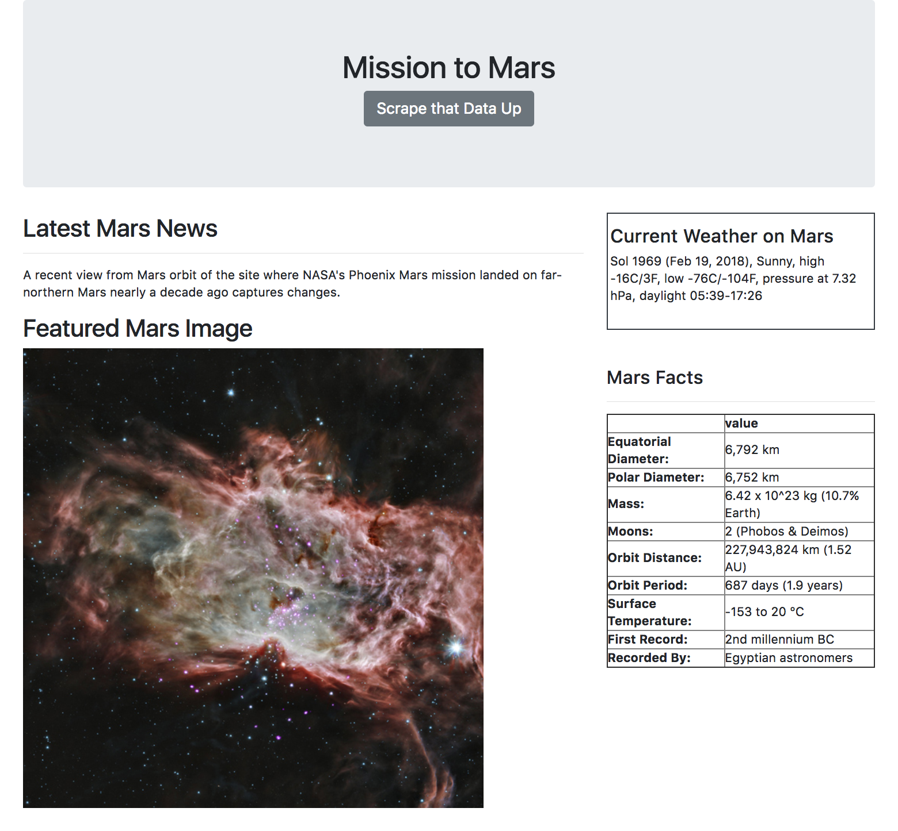

## Mission to Mars


# Objective

In this assignment, I will build a web application that scrapes various websites for data related to the Mission to Mars and displays the information in a single HTML page. The following outlines what I need to do.

---

---


## Step 1 - Scraping

Complete the initial scraping using Jupyter Notebook, BeautifulSoup, Pandas, Requests/Splinter and/or a mix of these. Utilize whatever is need to complete the objective in the most efficient way possible.

* Create a Jupyter Notebook file called `mission_to_mars.ipynb` and use this to complete all of the scraping and analysis tasks. The following outlines what needs to be scraped.

### NASA Mars News

* Scrape the [NASA Mars News Site](https://mars.nasa.gov/news/) and collect the latest News Title and Paragragh Text. Assign the text to variables that can be referenced later.

```python
# Example:
news_title = "NASA's Next Mars Mission to Investigate Interior of Red Planet"

news_p = "Preparation of NASA's next spacecraft to Mars, InSight, has ramped up this summer, on course for launch next May from Vandenberg Air Force Base in central California -- the first interplanetary launch in history from America's West Coast."
```

### JPL Mars Space Images - Featured Image

* Visit the url for JPL's Featured Space Image [here](https://www.jpl.nasa.gov/spaceimages/?search=&category=Mars).

* Use splinter to navigate the site and find the image url for the current Featured Mars Image and assign the url string to a variable called `featured_image_url`.

* Find the image url to the full size `.jpg` image.

* Save a complete url string for this image.

```python
# Example:
featured_image_url = 'https://www.jpl.nasa.gov/spaceimages/images/largesize/PIA16225_hires.jpg'
```

### Mars Weather

* Visit the Mars Weather twitter account [here](https://twitter.com/marswxreport?lang=en) and scrape the latest Mars weather tweet from the page. Save the tweet text for the weather report as a variable called `mars_weather`.

```python
# Example:
mars_weather = 'Sol 1801 (Aug 30, 2017), Sunny, high -21C/-5F, low -80C/-112F, pressure at 8.82 hPa, daylight 06:09-17:55'
```

### Mars Facts

* Visit the Mars Facts webpage [here](http://space-facts.com/mars/) and use Pandas to scrape the table containing facts about the planet including Diameter, Mass, etc.

* Use Pandas to convert the data to a HTML table string.

### Mars Hemisperes

* Visit the USGS Astrogeology site [here](https://astrogeology.usgs.gov/search/results?q=hemisphere+enhanced&k1=target&v1=Mars) to obtain high resolution images for each of Mar's hemispheres.

* Explicity click each of the links to the hemispheres in order to find the image url to the full resolution image.

* Save both the image url string for the full resolution hemipshere image, and the Hemisphere title containing the hemisphere name. Use a Python dictionary to store the data using the keys `img_url` and `title`.

* Append the dictionary with the image url string and the hemisphere title to a list. This list will contain one dictionary for each hemisphere.

```python
# Example:
hemisphere_image_urls = [
    {"title": "Valles Marineris Hemisphere", "img_url": "..."},
    {"title": "Cerberus Hemisphere", "img_url": "..."},
    {"title": "Schiaparelli Hemisphere", "img_url": "..."},
    {"title": "Syrtis Major Hemisphere", "img_url": "..."},
]
```

---

## Step 2 - MongoDB and Flask Application

Use MongoDB with Flask templating to create a new HTML page that displays all of the information that was scraped from the URLs above.

* Start by converting the Jupyter notebook into a Python script called `scrape_mars.py` with a function called `scrape` that will execute all of the scraping code from above and return one Python dictionary containing all of the scraped data.

* Next, create a route called `/scrape` that will import the `scrape_mars.py` script and call the `scrape` function.

* Store the return value in MongoDB as a Python dictionary.

* Create a root route `/` that will query the Mongo database and pass the mars data into an HTML template to display the data.

* Create a template HTML file called `index.html` that will take the mars data dictionary and display all of the data in the appropriate HTML elements.


---

---

# Solution

## System Prep

In order to run this application you will need to have Python version 3.6.3 installed on your system. If you do not have it installed then you can read about how to install it [here](https://docs.python.org/3/using/windows.html#installing-python).

You're also going to need MongoDB, an unstructured data storage management system, on your local system. In order to download and install it either follow the instructions [here](https://docs.mongodb.com/manual/installation/) or brew install it, only if you already have the brew package manager installed, using this code in your bash coding application:
```bash
$ brew update
$ brew install mongodb
```

Afterwards download or clone this repository into your system and open up your system's shell, preferably using the terminal application running the bash shell. From there follow these instructions in order to install the required modules...

1. Move into the directory where this repo is stored:
```bash
$ cd /path/to/mission_to_mars/
```
2. pip install the modules from the requirements.txt file:
```bash
$ pip install -r requirements.txt
```

You're now ready to run this bad boy!

---

## Executing the Flask App

Follow these instructions sequentially in order to launch the application.

1. Open your bash application and start up the mongodb server by typing in and executing the following code:
```bash
$ mongod
```
2.  Open up another terminal tab or window and cd into the `solution/` directory of this repo. Type the following code to move into and execute the flask app `mars.py`:

```bash
$ cd /path/to/mission_to_mars/solution/
$ python mars.py

 * Running on http://127.0.0.1:5000/ (Press CTRL+C to quit)
 * Restarting with stat
 * Debugger is active!
 * Debugger PIN: ***-***-***
127.0.0.1 - - [01/Jan/2000 01:01:01] "GET / HTTP/1.1" 200 -
```

3. Congrats! The application is running successfully. Now, to view the result in a browser open up any browser, preferably anything but Internet Explorer, unless you really hate your life then be my guest. Type `localhost:5000` into the url bar and the application should open. Just press the __Scrape that Data Up__ button and wait a few seconds while the application does its thing and gathers the data before presenting it to you. The webpage should look similar to this after it is done processing...





# UPDATE! I am now Hosting this App on Heroku
## Click [HERE](https://mission-2-mars.herokuapp.com/)  to try it out
